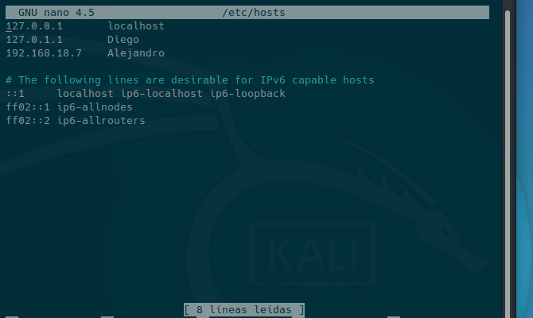
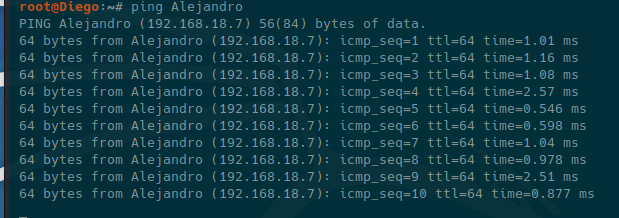
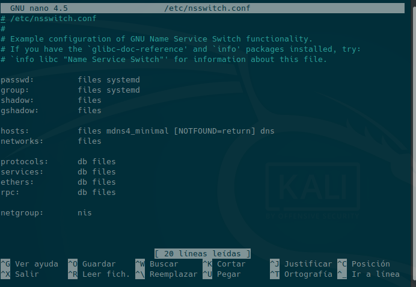

# LOS ARCHIVOS HOSTS Y NSSWITCH.CONF

- Para esta tarea he utilizado una máquina de Kali Linux (Debian)
- Vamos a definir que son los archivos **hosts y nsswitch.conf**, y cual es su función:

# HOSTS
- El archivo **"/etc/hosts"** es un archivo de un sistema operativo que almacena una lista con los nombres e IPs de los equipos de una máquina local, y este utiliza el sitema de nombres planos.

Aqui podemos un ejemplo de archivo host de Kali Linux, ejecutado con el terminal y pudiendo ver una configuración normal con solo 2 usuarios y el localhost. Comando para acceder:**nano /etc/hosts**

Y aquí podeis ver que ejecutando el comando ping y el nombre del usuario, nos devuelve en las respuestas la IP de este usuario, ya que esta almacenado en el archivo "hosts", si modificaramos el archivo hosts y cambiaramos la IP de ese usuario, nos devolvería esa IP que hemos cambiado.

# Nsswitch.conf

El archivo **nsswitch.conf** (Name Service Switch) es un archivo donde se encuentra la base de datos de determinados servicios como los archivos: hosts, passwd o shadow que son los archivos:**"hosts","shadow" o "passwd"** que almacenan datos como usuarios y contraseñas .
- Como podeis veren esta captura accediendo con **nano /etc/nsswitch.conf** existe una línea para cada servicio en el fichero:

