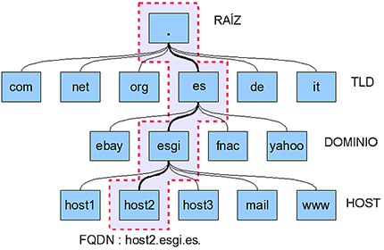

# Sistemas de nombres Planos y Jerárquicos

# Nombres planos: 
 Este es un sistema donde cada nombre es independiente, es decir, que no existe ninguna jerarquía ni relación entre ellos, por ejemplo, un DNI relaciona al nombre de una persona, o una dirección IP relaciona al nombre de un equipo.

# Nombres jerárquicos:
En este caso existe una jerarquía de nombres que definen el nombre de un host, por ejemplo, la calle, el número de portal y el código postal llevan al nombre de una persona, en este caso en un servidor DNS serían el TLD, el host, el dominio y el servidor raíz.

