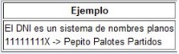

# Sistemas de nombres Planos y Jerárquicos
- Se desarolló para identificar un host y traducir su IP a un nombre, ya que para una persona es mucho más fácil identificar algo o alguien por un nombre simple, y hay 2 tipos de sistemas:

# Nombres planos: 
 Este es un sistema que se utilizaba anteriormente en el internet antiguo y actualmente en empresas o redes locales, donde cada nombre es independiente, es decir, que no existe ninguna jerarquía ni relación entre ellos, por ejemplo, un DNI relaciona al nombre de una persona, o una dirección IP relaciona al nombre de un equipo. En windows está el sistema de NetBIOS y en Linux el archivo host.

# Nombres jerárquicos:
Este se desarrolló por la razón de que el sistema de nombres planos no era sucifiente para identificar a todos los hosts en Internet, en este caso existe una jerarquía de nombres que definen el nombre de un host, por ejemplo, la calle, el número de portal y el código postal llevan al nombre de una persona, en este caso en un servidor DNS serían el TLD, el host, el dominio y el servidor raíz, actualmente es el sistema que utiliza DNS.

